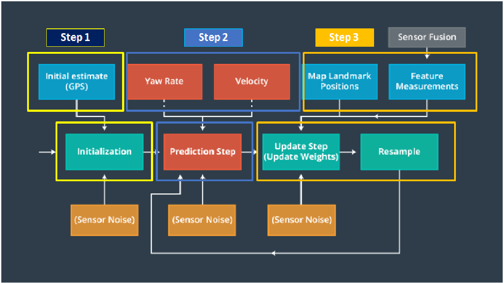

## Robot Localization with a particle filter
The target is to implement a 2 dimensional particle filter in C++. 

---------------------------------------------------------------------------
### Project Introduction
A robot has been transported to a new location.
The data input informations are :
- a map of this location,
- a (noisy) GPS estimate of its initial location, 
- a lots of (noisy) sensor and control data.

The particle filter will be given a map and some initial localization information (analogous to what a GPS would provide). 
At each time step the filter will also get observation and control data.

---------------------------------------------------------------------------
### Particle Filter Concept

This picture presents the concept of a particle filter :
<p align="center">

</p>

#### Step 1 : Initialization Step 
- Set the number of particles
- Initialization of all particles to first position (based on estimates x,y,theta, and their uncertainties from GPS)
- Initialization of all weights to 1
- Addition of random gaussian noise to each particle

#### Step 2 : Prediction Step
- Use of the CTRV (Constant Turn Rate and Velocity Magnitude Model) for the prediction
- Noise addition fo all the particles in X,Y and Theta

#### Intermediate Step : Data Association Step 
Data association between :
- the observation measurement from the Lidar
- the predicted measurement between every specific particle and all the landmarks observed from the sensor

#### Step 3 : Update Weights + Resample
- Transformation of each observations from vehicle local coordinates to map coordinates
- Measurement prediction for all landmarks within sensor range for each particle
- Association of the predicted landmark for every transformed observation (Call the intermediate Step)
- Update the weights of each particle with the multivariate gaussian probability density
- Normalize the weights of all particles since resampling using probilistic approach
- Resampling with the resampling probability with the weight importance (use of the wheel strategy: every particle with his respective weight has a part of the wheel)

----------------------------------------------------------------------------------------
### Running the Code
This project involves the Term 2 Simulator which can be downloaded [here](https://github.com/udacity/self-driving-car-sim/releases)

This repository includes two files that can be used to set up and install uWebSocketIO for either Linux or Mac systems. For windows you can use either Docker, VMware, or even Windows 10 Bash on Ubuntu to install uWebSocketIO.

Once the install for uWebSocketIO is complete, the main program can be built and ran by doing the following from the project top directory.

1. mkdir build
2. cd build
3. cmake ..
4. make
5. ./particle_filter

Alternatively some scripts have been included to streamline this process, these can be leveraged by executing the following in the top directory of the project:

1. ./clean.sh
2. ./build.sh
3. ./run.sh

Tips for setting up your environment can be found [here](https://classroom.udacity.com/nanodegrees/nd013/parts/40f38239-66b6-46ec-ae68-03afd8a601c8/modules/0949fca6-b379-42af-a919-ee50aa304e6a/lessons/f758c44c-5e40-4e01-93b5-1a82aa4e044f/concepts/23d376c7-0195-4276-bdf0-e02f1f3c665d)

-------------------------------------------------------------------------------
The program main.cpp has already been filled out.
Here is the main protocol that main.cpp uses for uWebSocketIO in communicating with the simulator.

#### INPUT: values provided by the simulator to the C++ program
// sense noisy position data from the simulator

["sense_x"]

["sense_y"]

["sense_theta"]


// get the previous velocity and yaw rate to predict the particle's transitioned state

["previous_velocity"]

["previous_yawrate"]

// receive noisy observation data from the simulator, in a respective list of x/y values

["sense_observations_x"]

["sense_observations_y"]


#### OUTPUT: values provided by the C++ program to the simulator
// best particle values used for calculating the error evaluation

["best_particle_x"]

["best_particle_y"]

["best_particle_theta"]

//Optional message data used for debugging particle's sensing and associations
// for respective (x,y) sensed positions ID label

["best_particle_associations"]


// for respective (x,y) sensed positions

["best_particle_sense_x"] <= list of sensed x positions

["best_particle_sense_y"] <= list of sensed y positions

------------------------------------------------------------------------------------
### Implementing the Particle Filter
The directory structure of this repository is as follows:

```
root
|   build.sh
|   clean.sh
|   CMakeLists.txt
|   README.md
|   run.sh
|
|___data
|   |   
|   |   map_data.txt
|   
|   
|___src
    |   helper_functions.h
    |   main.cpp
    |   map.h
    |   particle_filter.cpp
    |   particle_filter.h
```

The file contains the scaffolding of a `ParticleFilter` class and some associated methods. 
The file `src/main.cpp`  contains the code that will actually be running your particle filter and calling the associated methods.
The inputs to the particle filter are present in the  `data` directory.

#### The map
`map_data.txt` includes the position of landmarks (in meters) on an arbitrary Cartesian coordinate system. 
Each row has three columns:
1. x position
2. y position
3. landmark id

#### Evaluation Criteria
2 importants points for the evaluation :

- Accuracy : the particle filter should localize vehicle position and yaw to within the values specified in the parameters `max_translation_error` and `max_yaw_error` in `src/main.cpp`.

- Performance :  execution time of the particle filter max : 100 seconds.

